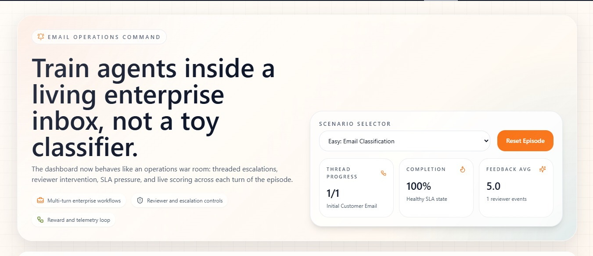

# MailMind.ai
OpenEnv-based reinforcement learning environment for email triage, enabling agents to classify, prioritize, and route emails with SLA-aware reward modeling and real-world workflow constraints.

# 🚀 MailMind.ai - Enterprise Email Triage Environment (OpenEnv)

> **A Real-World AI Simulation for Intelligent Enterprise Email Operations**

---

## 📌 Overview

Modern enterprises process **thousands of emails daily** across domains like support, HR, finance, and security. Handling these efficiently requires **accurate classification, prioritization, routing, and SLA management**.

This project is **not just a classifier** — it is a **high-fidelity AI training and evaluation environment** that simulates real-world enterprise email workflows.

💡 **Core Idea:**

> Build a system where AI agents *learn to operate inside a live enterprise inbox* using realistic constraints, feedback loops, and decision-making scenarios.



## 🔗 Live Demo

[🚀 Deployed Link](https://huggingface.co/spaces/MidNightCoders01/MailMind.ai)

---

## 🎯 Problem Statement

Design an AI-powered system where an agent can:

* 📩 Understand incoming emails (context, tone, urgency)
* 🧠 Make intelligent decisions:

  * Category classification
  * Priority assignment
  * Department routing
* 🔁 Handle multi-step workflows:

  * Escalations
  * Reviewer feedback
  * SLA pressure
* 📈 Maximize performance using a reward-based system

---

## 🧠 Key Features

✅ Real-world enterprise simulation (not a toy problem) <br>
✅ Multi-turn workflows with escalation logic <br>
✅ SLA-aware decision-making <br>
✅ Deterministic grading system <br>
✅ Reward-based learning environment <br>
✅ OpenEnv compliant architecture <br>
✅ Interactive frontend dashboard <br>
✅ Free LLM integration via Hugging Face Router <br>

---

## 🏗️ System Architecture

```
Dataset → Environment → Agent → Action → Grader → Reward → Loop
```

### 🔹 Components Breakdown

### 1. 📊 Dataset

* Synthetic + structured enterprise emails
* Includes:

  * Subject, Body
  * Category (ground truth)
  * Priority & Routing
  * SLA & Urgency signals

---

### 2. ⚙️ Environment (OpenEnv Core)

Implements:

* `reset()` → Initialize environment
* `step(action)` → Evaluate agent decision
* `state()` → Current system state

Supports:

* Multi-turn conversations
* Escalation workflows
* SLA tracking
* Human reviewer simulation

---

### 3. 🤖 Agent

* Runs via `inference.py`
* Uses **Hugging Face Router (OpenAI-compatible API)**
* Generates actions based on environment state

---

### 4. 🧮 Grader System

* Deterministic scoring engine
* Evaluates:

  * Category accuracy
  * Priority correctness
  * Routing accuracy

📊 Output: `score ∈ [0.0, 1.0]`

---

### 5. 🎯 Reward System

Provides continuous feedback:

* ✅ Partial rewards for correct decisions
* ❌ Penalties for:

  * SLA violations
  * Incorrect routing
  * Ignoring urgency

---

### 6. 🌐 API Layer

Endpoints:

* `/reset`
* `/step`
* `/state`
* `/health`
* `/metadata`
* `/schema`

---

### 7. 📊 Frontend Dashboard

A visual **Email Operations Command Center**:

* 📬 Live email threads
* 🤖 Agent decisions
* 🚨 Escalation tracking
* 📈 Reward progression
* 📊 System telemetry

---

## 🎮 Task Levels

### 🟢 Easy — Basic Classification

* Single email
* Classify + route

---

### 🟡 Medium — Context-Aware Triage

* Includes SLA & urgency
* Requires prioritization intelligence

---

### 🔴 Hard — Multi-Turn Workflow

* Threaded conversations
* Escalations + feedback loops
* Queue pressure simulation

---

## 🔄 OpenEnv Interface

### 📥 Observation (State)

```json
{
  "subject": "...",
  "body": "...",
  "sender_type": "...",
  "sla_hours": 24,
  "urgency_flag": 1
}
```

### 📤 Action

```json
{
  "category": "human_resources",
  "priority": "high",
  "route": "people_ops"
}
```

### 🔁 Step Output

```json
{
  "observation": {...},
  "reward": 0.75,
  "done": false,
  "info": {}
}
```

---

## ⚡ Baseline Model Setup

Uses **Meta LLaMA 3 via Hugging Face Router**

### 🔐 Environment Variables

```
API_BASE_URL=https://router.huggingface.co/v1
HF_TOKEN=your_token
MODEL_NAME=meta-llama/Meta-Llama-3-8B-Instruct
```

### ▶️ Run

```bash
python inference.py
```

---

## 🚀 Deployment

* 🐳 Dockerized for easy setup
* ☁️ Deployable on Hugging Face Spaces
* ✅ OpenEnv compliant

---

## 🏆 Why This Project Stands Out

### 🔥 Real-World Impact

Simulates actual enterprise workflows — directly applicable to industry systems.

### 🎯 Strong Evaluation Design

* Multi-level tasks (easy → hard)
* Deterministic grading
* Clear performance metrics

### 🧩 Advanced System Design

* Clean state transitions
* Reward-driven learning loop
* Modular architecture

### 💡 Innovation

* Human-in-the-loop simulation
* Multi-turn AI reasoning
* Enterprise-grade scenario modeling

---

## 🔮 Future Improvements

* 📚 Expand datasets (legal, security, spam)
* 🧠 Add long-term agent memory
* 🤝 Multi-agent collaboration
* 📊 Real-time analytics dashboard
* 🎯 Reinforcement learning training loop

---

## 🧾 Conclusion

This project bridges the gap between:

> ❌ Simple ML classification tasks
> ✅ Real-world enterprise decision-making systems

💡 **Key Insight:**

> This is not just an email app — it’s a **training ground for intelligent enterprise AI agents**.

---

## 👨‍💻 Author

** MailMind.ai Team**

---


